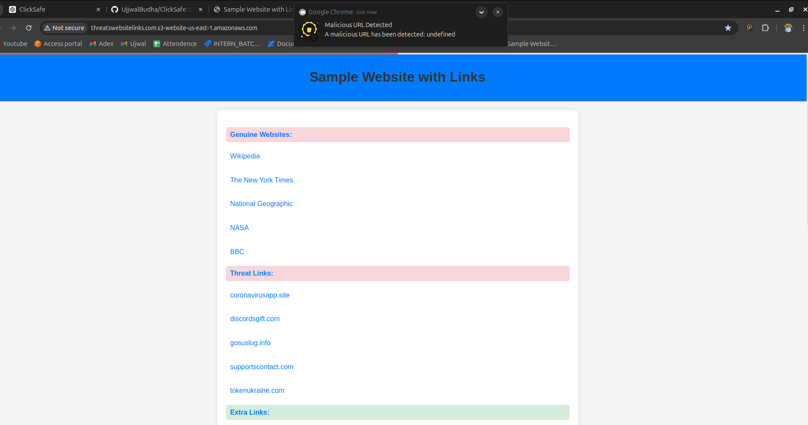

# ClickSafe Chrome Extension

ClickSafe is a Chrome extension designed to enhance your online security by analyzing links on the current webpage. It notifies you if any links are potentially malicious, ensuring a safer browsing experience. The extension provides visual indicators for link safety and a status bar to show the overall safety of the page. Additionally, it features notifications to alert you when malicious URLs are detected.

## Features

- **Link Analysis**: Analyzes links on the current webpage and indicates their safety.
- **Visual Indicators**: Displays visual indicators next to links to show if they are safe or malicious.
- **Status Bar**: Shows a status bar at the top of the page indicating the overall safety of the links on the page.
- **Notifications**: Sends desktop notifications when malicious URLs are detected.

## Installation

1. Clone the repository:
    ```sh
    git clone https://github.com/yourusername/clicksafe.git
    ```
2. Navigate to the project directory:
    ```sh
    cd clicksafe
    ```
3. Open Chrome and go to `chrome://extensions/`.
4. Enable "Developer mode" by clicking the toggle switch in the top right corner.
5. Click the "Load unpacked" button and select the project directory.

## Usage

- **Protection Toggle**: Enable or disable protection through the popup interface.
- **Scanned URLs**: Click "Show Scanned URLs" in the popup to view all scanned URLs.
- **Malicious URLs**: Click "Show Malicious URLs" in the popup to view all malicious URLs detected.

## Demo


*Initial setup and activation of ClickSafe.*


*Status bar indicating overall page safety.*


*Notification showing a detected malicious URL.*

## Test URL

To see ClickSafe in action, visit our [test website](http://threatswebsitelinks.com.s3-website-us-east-1.amazonaws.com/).

## File Structure

- **manifest.json**: Contains the extension's configuration and permissions.
- **background.js**: Handles background tasks and notifications.
- **content.js**: Contains the main logic for analyzing links and updating the UI.
- **popup.html**: The HTML for the extension's popup interface.
- **popup.js**: Handles the logic for the popup interface.
- **styles.css**: Contains styles for the popup interface.

## Permissions

The extension requires the following permissions:

- `activeTab`: To access the current tab's information.
- `storage`: To store validated URLs and user settings.
- `notifications`: To send desktop notifications for malicious URLs.

## Development

### Background Script (`background.js`)

Handles installation events, storage changes, and notifications.

### Content Script (`content.js`)

Analyzes links, updates the UI, and sends notifications.

## Contributing

If you'd like to contribute to this project, please fork the repository and use a feature branch. Pull requests are warmly welcome.

## License

This project is licensed under the MIT License - see the LICENSE file for details.
